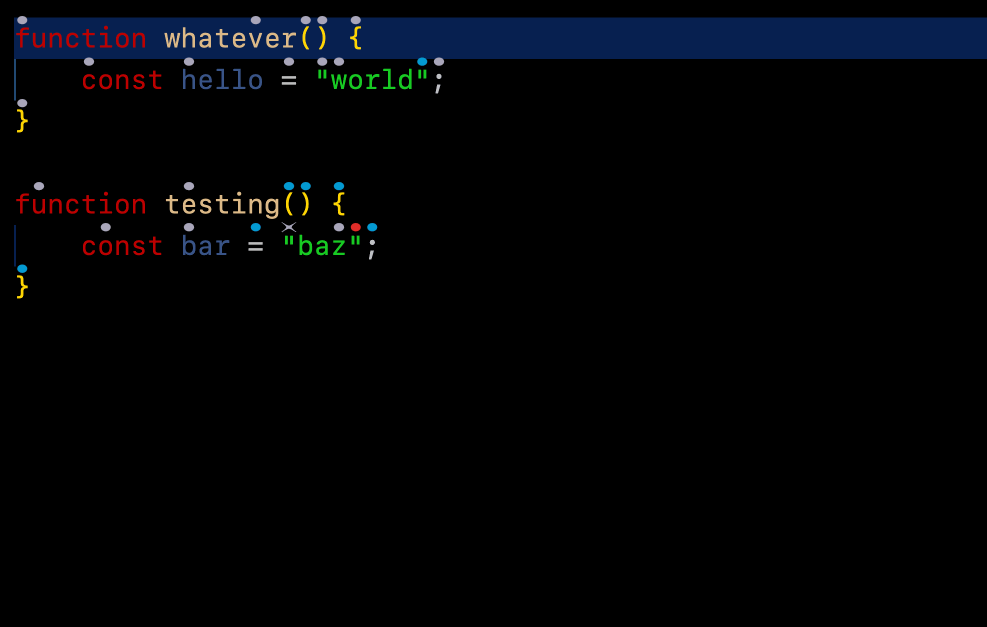
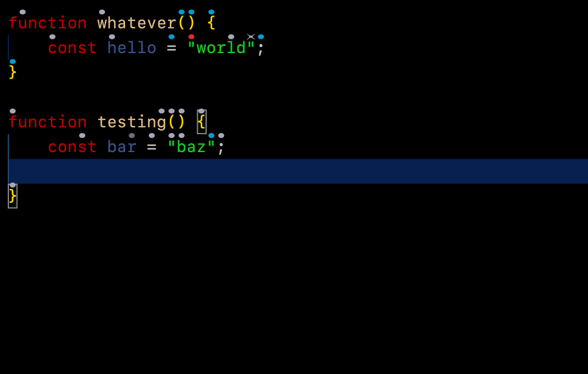
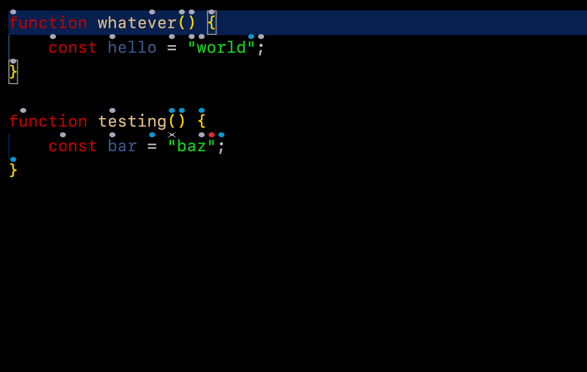

# Modal keyboard interface

Cursorless has an experimental modal keyboard interface. This allows you to switch to Cursorless mode, and then you can use your keyboard to control Cursorless without holding any modifier keys, similar to how `vim` works.

The cursorless keyboard interface works by moving a highlight around, and allowing you to perform actions on the highlighted target.





## Set up / config

### `keybindings.json`

Paste the following into your `keybindings.json`:

```json
    {
        "key": "ctrl+c",
        "command": "cursorless.keyboard.modal.modeOn",
        "when": "editorTextFocus"
    },
    {
        "key": "escape",
        "command": "cursorless.keyboard.escape",
        "when": "cursorless.keyboard.listening && editorTextFocus && !suggestWidgetMultipleSuggestions && !suggestWidgetVisible"
    },
    {
        "key": "backspace",
        "command": "cursorless.keyboard.targeted.runActionOnTarget",
        "args": "remove",
        "when": "cursorless.keyboard.modal.mode && editorTextFocus"
    }
```

Any keybindings that use modifier keys should go in `keybindings.json` as well, with a `"when": "cursorless.keyboard.modal.mode` clause.

The above allows you to press `ctrl-c` to switch to Cursorless mode, `escape` to exit Cursorless mode, and `backspace` to issue the delete action while in Cursorless mode.

### `settings.json`

To bind keys that do not have modifiers (eg just pressing `a`), add entries like the following to your `settings.json`:

```json
    "cursorless.keyboard.modal.keybindings.scopes": {
        "L": "line",
        "ss": "string",
        "st": "statement",
        "sf": "namedFunction",
    },
    "cursorless.keyboard.modal.keybindings.actions": {
        "t": "setSelection",
        "h": "setSelectionBefore",
        "l": "setSelectionAfter",
        "k": "editNewLineBefore",
        "K": "insertCopyBefore",
        "j": "editNewLineAfter",
        "J": "insertCopyAfter",
        "u": "replaceWithTarget",
        "c": "clearAndSetSelection",
        "as": "swapTargets",
        "af": "fold",
    },
    "cursorless.keyboard.modal.keybindings.colors": {
        "m": "default",
        "b": "blue",
        "g": "green",
        "r": "red"
    },
    "cursorless.keyboard.modal.keybindings.shapes": {
        "df": "fox",
        "db": "frame",
        "dx": "ex",
    },
```

Any supported scopes, actions, or colors can be added to these sections, using the same identifierss that appear in the second column of your customisation csvs. Feel free to add / tweak / remove the keyboard shortcuts above as you see fit.

The above allows you to press `b` followed by any letter to highlight the given token, `l` to expand to its containing line, and `t` to select the given target.

Note that key sequences are supported, eg mapping the sequence `af` to the fold action.
